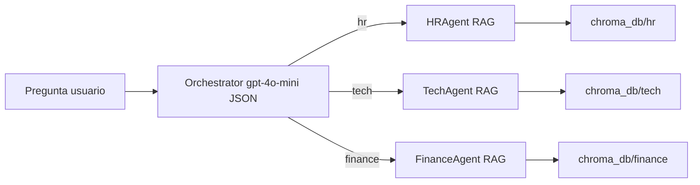

# Integrator Project — Sistema multi-agente RAG

Aplicación de consola que simula un asistente corporativo: primero **clasifica** la pregunta del usuario en uno de tres dominios (RRHH, tecnología o finanzas) con un modelo de lenguaje; luego **responde** usando recuperación aumentada por generación (RAG) sobre documentación interna almacenada en bases vectoriales Chroma.

## Cómo funciona

1. **Orquestador** (`src/agents/orchestrator.py`): usa `gpt-4o-mini` con salida JSON (`destination`, `reasoning`) para elegir entre `hr`, `tech` y `finance`.
2. **Agentes especialistas** (`src/agents/*.py`): cada uno ejecuta una cadena RAG (retriever sobre Chroma + LLM) con los mismos embeddings OpenAI (`text-embedding-3-small`) y recupera hasta `k=3` fragmentos antes de responder.



El punto de entrada interactivo es `main.py`: escribís preguntas en bucle hasta escribir `salir`.

## Requisitos

- **Python** 3.12 o superior (`pyproject.toml`, `.python-version`).
- Cuenta de **OpenAI** con API key válida (embeddings + chat).

## Instalación

Ejecutá los comandos desde la **raíz del repositorio** para que los imports `src.*` resuelvan correctamente.

### Con uv (recomendado si usás el lockfile del proyecto)

```bash
uv sync
```

### Con pip

```bash
python -m venv .venv
source .venv/bin/activate   # Windows: .venv\Scripts\activate
pip install -r requirements.txt
```

## Variables de entorno

Creá un archivo `.env` en la raíz del proyecto.

| Variable | Obligatoria | Descripción |
|----------|-------------|-------------|
| `OPENAI_API_KEY` | Sí | Usada por el orquestador, los tres agentes RAG y la construcción de embeddings en `vector_store.py`. |
| `LANGFUSE_PUBLIC_KEY` | No | Definida en `src/config.py`; **no está cableada** en la lógica actual de la app. Reservada si más adelante integrás trazas con Langfuse. |
| `LANGFUSE_SECRET_KEY` | No | Igual que la anterior. |
| `LANGFUSE_HOST` | No | Por defecto en código: `https://us.cloud.langfuse.com` si la definís. |

Ejemplo mínimo:

```env
OPENAI_API_KEY=sk-...
```

## Estructura del proyecto

```
integrator-project/
├── main.py                 # CLI interactiva
├── pyproject.toml
├── requirements.txt
├── uv.lock
├── data/
│   ├── hr_docs/            # Markdown fuente RRHH
│   ├── tech_docs/          # Markdown fuente tecnología
│   └── finance_docs/       # Markdown fuente finanzas
├── src/
│   ├── config.py           # Rutas, dominios, carga .env
│   ├── vector_store.py     # Indexa .md → Chroma (chunks 1000, solapamiento 200)
│   ├── data_generator.py   # Opcional: genera .md con OpenAI
│   ├── agents/
│   │   ├── orchestrator.py
│   │   ├── hr_agent.py
│   │   ├── tech_agent.py
│   │   └── finance_agent.py
│   └── utils/
│       └── logger.py
├── chroma_db/              # Generado al indexar (hr/, tech/, finance/)
└── test/
    └── test_queries.json   # Consultas de ejemplo (solo referencia manual)
```

Los índices persisten bajo `chroma_db/<dominio>/` (`Config.CHROMA_PATH` en `src/config.py`).

## Comandos paso a paso

1. **Configurar `.env`** con `OPENAI_API_KEY`.

2. **(Opcional)** Regenerar documentos de `data/` con el LLM:

   ```bash
   uv run python src/data_generator.py
   ```

   Esto vuelve a pedir contenido a OpenAI y **escribe nuevos archivos `.md`** en las carpetas por dominio. Solo necesario si querés datos distintos a los que ya vienen en el repo.

3. **Construir o actualizar los índices vectoriales** (necesario la primera vez y cuando cambien los `.md`):

   ```bash
   uv run python src/vector_store.py
   ```

   Si ya tenés `chroma_db/hr`, `chroma_db/tech` y `chroma_db/finance` coherentes con tus fuentes, no hace falta reindexar hasta que modifiques documentación.

4. **Iniciar el chat**:

   ```bash
   uv run python main.py
   ```

Si no usás `uv`, activá el entorno virtual y sustituí `uv run` por `python` en los mismos comandos.

## Uso de la CLI

- Escribí una pregunta y pulsá Enter.
- El programa muestra una tabla (Rich) con la consulta, el **agente destino** y el **razonamiento** del orquestador.
- Luego imprime la **respuesta del experto** basada en el contexto recuperado.
- Para salir: `salir` (sin distinguir mayúsculas).

## Dominios que espera el orquestador

Alineado con el prompt en `orchestrator.py`:

- **hr**: vacaciones, beneficios, conducta, RRHH.
- **tech**: arquitectura, código, seguridad, sistemas.
- **finance**: presupuestos, gastos, impuestos, facturas.

## Consultas de prueba

El archivo `test/test_queries.json` lista preguntas de ejemplo y el dominio esperado (`expected`). Sirve para **probar el enrutamiento a mano** en la CLI; el repo **no incluye** un runner automatizado que lo ejecute.

## Solución de problemas

- **`OPENAI_API_KEY no encontrada`** al correr `vector_store.py` o `data_generator.py`: falta la variable en `.env` o el archivo no está en la raíz. El arranque de `main.py` no llama a `Config.validate()`, pero las llamadas a la API fallarán igual sin clave.
- **Respuestas vacías o errores de Chroma**: ejecutá `python src/vector_store.py` al menos una vez tras tener los `.md` en `data/`.
- **Coste / cuotas**: indexación y chat usan modelos OpenAI (`gpt-4o-mini`, `text-embedding-3-small`); el generador de datos opcional añade más llamadas si lo usás.
